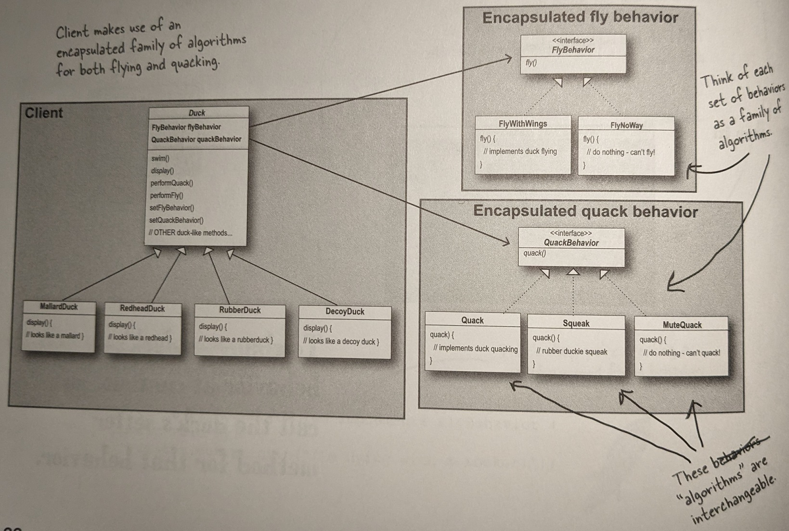

# Strategy

The Strategy Design Pattern works by separating the behavior of an object from the object itself.
The behavior is encapsulated into different strategies, each with its own implementation of the behavior.
The context maintains a reference to a strategy object and interacts with it through a common interface.

